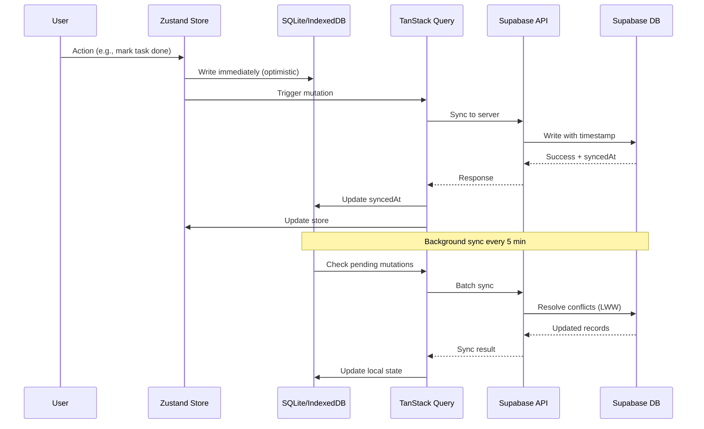

# Neurodivergent-Friendly Weekly Planner - Build-Ready Product Specification

**Version:** 1.0  
**Date:** 2024  
**Status:** MVP Planning

---

## Table of Contents

1. [Product Overview](#product-overview)
2. [User Stories & Acceptance Criteria](#user-stories--acceptance-criteria)
3. [Data Model](#data-model)
4. [State & Sync Architecture](#state--sync-architecture)
5. [Notification System](#notification-system)
6. [MVP Build Plan](#mvp-build-plan)
7. [Tone & Safety Guidelines](#tone--safety-guidelines)
8. [Technical Architecture](#technical-architecture)

---

## Product Overview

### Core Concept
A hybrid scheduling app that helps neurodivergent users (ADHD/autistic) maintain a sustainable weekly rhythm with minimal decision fatigue. Each day has exactly ONE "Primary Block" (day theme), with optional Work Window overlays that shift timing but don't compete as block types.

### Key Principles
- **Sustainable by default** (not "productive without burnout")
- **One obvious next action** at a time
- **Energy-aware adaptation** (Green/Yellow/Red modes)
- **Local-first** with optional sync
- **Privacy-respecting** (opt-in analytics)
- **No medical claims** (supplements are reminders only)

### Weekly Rhythm Model
- **Normal (default):** 2 Focus days, 2 Recharge days, 2 Flex days, 1 Admin day
- **Light:** 1 Focus, 3 Recharge, 2 Flex, 1 Admin
- **Heavy:** 3 Focus, 1 Recharge, 2 Flex, 1 Admin (with burnout warning)

### Target Users
- **Primary:** Adults managing work + household; executive function challenges
- **Secondary:** Adults without structured work (app fully functional)

---

## User Stories & Acceptance Criteria

### 1. Onboarding (2 minutes)

#### User Story 1.1: Work Window Detection
**As a** new user  
**I want to** quickly indicate my work schedule  
**So that** the app can place my Primary Blocks appropriately

**Acceptance Criteria:**
- [ ] Screen asks: "Do you have structured work/study time?" with options:
  - Yes, mostly weekdays
  - Yes, rotating/irregular
  - No
- [ ] If "Yes, mostly weekdays":
  - [ ] Show simple template: Mon-Fri with start/end time pickers
  - [ ] Ask: "After work energy tends to be" [low / mixed / decent]
  - [ ] Store as `workMode: 'weekdays'` with `workWindows: [{days: [1,2,3,4,5], start: '09:00', end: '17:00'}]`
- [ ] If "Yes, rotating/irregular":
  - [ ] Store as `workMode: 'irregular'` (disables strict scheduling, uses evening defaults)
- [ ] If "No":
  - [ ] Skip work windows entirely
  - [ ] Ask: "When is your preferred energy peak?" [morning / afternoon / evening]
  - [ ] Store as `preferredPrimaryBlockTime`

#### User Story 1.2: Sleep & Downshift Setup
**As a** new user  
**I want to** set my sleep window and downshift reminder  
**So that** I get gentle bedtime cues

**Acceptance Criteria:**
- [ ] Time picker for sleep window start (bedtime)
- [ ] Time picker for sleep window end (wake time)
- [ ] Toggle for "Downshift reminder" (30 min before bedtime)
- [ ] Store in `UserPrefs.sleepWindow` and `UserPrefs.downshiftReminderEnabled`

#### User Story 1.3: Week Intensity Default
**As a** new user  
**I want to** choose my default weekly intensity  
**So that** the app generates appropriate week plans

**Acceptance Criteria:**
- [ ] Radio buttons: Light / Normal / Heavy
- [ ] Show brief description of each (Focus/Recharge/Flex counts)
- [ ] Heavy shows warning: "Higher risk of burnout. Start with Normal?"
- [ ] Store as `UserPrefs.weekIntensityDefault`

#### User Story 1.4: Recharge Activities Selection
**As a** new user  
**I want to** pick my default recharge activities  
**So that** Recharge Runner has relevant options

**Acceptance Criteria:**
- [ ] Multi-select (pick 3) from: movie, reading, walk, bath, hobby, gaming, music, nature, other (custom)
- [ ] Store as `UserPrefs.rechargeDefaults: string[]`

#### User Story 1.5: Supplements Templates (Optional)
**As a** new user  
**I want to** optionally enable supplement reminders  
**So that** I can scaffold routines without the app prescribing

**Acceptance Criteria:**
- [ ] Toggle: "Enable supplement reminders?"
- [ ] If enabled, show template selector:
  - Basics (conservative)
  - Sleep support
  - Busy/low appetite day
  - Focus-friendly day
- [ ] Each template shows preview of items with safety notes
- [ ] User can deselect individual items before confirming
- [ ] Store as `UserSupplementPlan` entries with `templateSource`

---

### 2. Today Screen (Core Loop)

#### User Story 2.1: Energy Check
**As a** user  
**I want to** log my morning energy level  
**So that** the app adapts my day plan

**Acceptance Criteria:**
- [ ] Prominent slider on Today screen (AM only, or can update)
- [ ] Visual indicators: Green (4-5) / Yellow (2-3) / Red (0-1)
- [ ] Auto-label: "Today is a [Green/Yellow/Red] plan"
- [ ] Store in `EnergyLog` with `timestamp`, `period: 'am'`, `value: 0-5`
- [ ] Red Day Mode automatically:
  - [ ] Simplifies Top 3 to MVD (Minimum Viable Day)
  - [ ] Shows MVD card prominently
  - [ ] Suppresses non-essential notifications
  - [ ] Reduces Primary Block duration suggestions

#### User Story 2.2: Primary Block Display
**As a** user  
**I want to** see my one clear Primary Block for today  
**So that** I know exactly what to do next

**Acceptance Criteria:**
- [ ] Large card showing: "Today is a [Focus/Flex/Recharge/Admin] day"
- [ ] Shows scheduled time (if work window exists: "After work: 6:00 PM")
- [ ] Big "Start" button that launches appropriate Runner
- [ ] On Red days, Primary Block becomes MVD version automatically
- [ ] User can tap to:
  - [ ] Move earlier/later
  - [ ] Swap with tomorrow
  - [ ] Convert Focus → Flex (when capacity drops)

#### User Story 2.3: Top 3 Tasks
**As a** user  
**I want to** see max 3 tasks for today  
**So that** I'm not overwhelmed

**Acceptance Criteria:**
- [ ] Display max 3 tasks from `Task` table where `day = today` and `status != 'done'`
- [ ] Each shows: title, outcome (optional), nextStep
- [ ] On Red days, only show MVD tasks (user can mark tasks as "MVD essential")
- [ ] Tap to mark done or edit
- [ ] "Add Top 3" button (prompts: "What's the outcome? What's the next tiny step?")

#### User Story 2.4: Evening Block (Work Window Users)
**As a** user with work windows  
**I want to** see my evening plan and transition cue  
**So that** I can smoothly shift from work to evening block

**Acceptance Criteria:**
- [ ] Card appears only if `workWindows` exist OR user prefers evenings
- [ ] Shows: "After work: [Primary Block type] (30 min) + [optional Recharge]"
- [ ] Transition cue: "Start with 2-min activation" (expandable checklist)
- [ ] One-tap "Start Evening Block" when work ends

#### User Story 2.5: MVD Card (Red Days)
**As a** user on a Red day  
**I want to** see a simplified Minimum Viable Day plan  
**So that** I can protect my energy

**Acceptance Criteria:**
- [ ] Card appears automatically when energy is Red
- [ ] Shows: "Today: [1-2 essential tasks] + [hydration] + [one meal]"
- [ ] Optional on Yellow days (user toggle)
- [ ] Can be dismissed (but reappears if energy stays Red)

---

### 3. Focus Runner

#### User Story 3.1: Start Ritual
**As a** user  
**I want to** complete a quick ritual before focusing  
**So that** I'm properly set up

**Acceptance Criteria:**
- [ ] Checklist appears before timer starts (customizable, 30-90 sec)
- [ ] Default items: "Phone away", "Water nearby", "Comfortable position", "Clear workspace"
- [ ] User can add/edit/remove items
- [ ] All checked → "Begin Focus" button appears

#### User Story 3.2: Focus Timers
**As a** user  
**I want to** run 2 focused work sessions with a break  
**So that** I can sustain focus without burnout

**Acceptance Criteria:**
- [ ] First timer: 25-45 min (user choice, default 30)
- [ ] Break: 5-10 min (user choice, default 5)
- [ ] Second timer: 25-45 min (same duration as first)
- [ ] Timer shows: countdown, optional ambient sound, haptic feedback on completion
- [ ] "Pause" button (resume or abandon)
- [ ] "Later" capture button (opens inbox, doesn't stop timer)

#### User Story 3.3: Later Capture (Inbox)
**As a** user during focus  
**I want to** quickly capture distracting thoughts  
**So that** I can return to them later without losing focus

**Acceptance Criteria:**
- [ ] "Later" button opens quick capture modal
- [ ] Text input: "What came up?"
- [ ] Saves to `InboxItem` table with `capturedAt` timestamp
- [ ] Returns to timer immediately
- [ ] Inbox appears in Weekly Rhythm View (separate from tasks)

#### User Story 3.4: Hard Stop & Next Step
**As a** user finishing focus  
**I want to** capture my next tiny step  
**So that** I can resume easily later

**Acceptance Criteria:**
- [ ] After second timer ends, show: "Hard stop. What's your next tiny step?"
- [ ] Text input (optional)
- [ ] If task exists, update `Task.nextStep`
- [ ] If new, create `InboxItem` or `Task` (user choice)
- [ ] "Done" button → returns to Today screen

---

### 4. Recharge Runner

#### User Story 4.1: Recharge Type Selection
**As a** user  
**I want to** choose my recharge type  
**So that** I can match my energy level

**Acceptance Criteria:**
- [ ] Three options:
  - Micro-recharge (10-20 min)
  - Full recharge (45-90 min)
  - Gentle reset (shower + comfy + tea + music)
- [ ] Each shows estimated duration and description
- [ ] User picks one → shows ritual checklist

#### User Story 4.2: Recharge Ritual
**As a** user  
**I want to** complete a simple ritual before recharging  
**So that** I transition intentionally

**Acceptance Criteria:**
- [ ] Checklist: "Phone down", "Lights adjusted", "Comfort item ready", "Distractions minimized"
- [ ] Customizable (user can edit)
- [ ] All checked → "Begin Recharge" button

#### User Story 4.3: Recharge Timer (Optional)
**As a** user  
**I want to** optionally set a timer for recharge  
**So that** I don't lose track of time

**Acceptance Criteria:**
- [ ] Toggle: "Set timer?" (default off for Gentle Reset)
- [ ] If on, show duration picker (matches recharge type)
- [ ] Timer runs with gentle sound/haptic on completion
- [ ] Can dismiss timer and continue

#### User Story 4.4: Return Ramp
**As a** user finishing recharge  
**I want to** choose my transition back  
**So that** I don't crash after rest

**Acceptance Criteria:**
- [ ] After timer/activity ends, show: "Return ramp"
- [ ] Options:
  - "Done for day" (marks evening as complete)
  - "5-min Flex task" (opens Flex Sprint with 5-min preset)
- [ ] User choice → returns to Today screen

---

### 5. Flex Sprint

#### User Story 5.1: Zone/Template Selection
**As a** user  
**I want to** pick a chore/errand zone  
**So that** I can do a quick reset

**Acceptance Criteria:**
- [ ] Options: Kitchen, Laundry, Inbox, Calls, Errands, Other (custom)
- [ ] Each shows a quick checklist template (user can customize)
- [ ] Duration: 10-20 min (user choice, default 15)

#### User Story 5.2: Flex Sprint Execution
**As a** user  
**I want to** run a short focused reset  
**So that** I can clear small tasks without overwhelm

**Acceptance Criteria:**
- [ ] Timer starts (10-20 min)
- [ ] Checklist visible (can check off items)
- [ ] "Pause" button available
- [ ] On completion: "What's your next tiny step?" capture

---

### 6. Admin Sprint

#### User Story 6.1: Admin Categories
**As a** user  
**I want to** pick admin categories  
**So that** I can handle admin tasks efficiently

**Acceptance Criteria:**
- [ ] Options: Bills, Calendar, Email, Planning, Other
- [ ] Multi-select allowed
- [ ] Duration: 15-30 min (user choice, default 20)

#### User Story 6.2: Admin Sprint Execution
**As a** user  
**I want to** run a focused admin session  
**So that** I can handle admin without it taking over my day

**Acceptance Criteria:-
- [ ] Timer starts (15-30 min)
- [ ] Category checklist visible
- [ ] "Pause" button available
- [ ] On completion: "What's your next tiny step?" capture

---

### 7. Weekly Rhythm View

#### User Story 7.1: Week at a Glance
**As a** user  
**I want to** see my week's day themes  
**So that** I understand my rhythm

**Acceptance Criteria:**
- [ ] 7 day chips showing: F (Focus), R (Recharge), X (Flex), A (Admin)
- [ ] Work Window overlay visible as subtle band on relevant days
- [ ] Today highlighted
- [ ] Tap day → shows that day's Primary Block + Top 3

#### User Story 7.2: Day Detail View
**As a** user  
**I want to** see a single day's plan  
**So that** I can focus on one day at a time

**Acceptance Criteria:**
- [ ] Shows: Day theme, Primary Block scheduled time, Top 3 tasks
- [ ] Work Window visible if applicable
- [ ] "Back to Week" button
- [ ] Can edit Primary Block (move, swap, convert)

#### User Story 7.3: Later Inbox Management
**As a** user  
**I want to** manage my Later Inbox  
**So that** it doesn't become a backlog graveyard

**Acceptance Criteria:**
- [ ] Inbox appears in Weekly Rhythm View (separate section)
- [ ] Shows all `InboxItem` entries (not auto-promoted)
- [ ] Weekly prompt (Sunday): "Review Later Inbox" (prune, promote, delete)
- [ ] Can promote to Task (with day assignment) or delete
- [ ] Max 20 items (warning at 15, hard limit at 20)

---

### 8. Sunday Setup

#### User Story 8.1: Intensity Selection
**As a** user  
**I want to** choose this week's intensity  
**So that** the app generates an appropriate plan

**Acceptance Criteria:**
- [ ] Radio buttons: Light / Normal / Heavy
- [ ] Heavy shows burnout warning
- [ ] Stores in `WeekPlan.intensity`

#### User Story 8.2: Week Plan Generation
**As a** user  
**I want to** see my auto-generated week plan  
**So that** I can confirm or adjust it

**Acceptance Criteria:**
- [ ] App generates day themes based on intensity + work windows
- [ ] Default placement (workdays → evening, weekends → preferred time)
- [ ] Shows 7-day preview with one-tap reorder
- [ ] User can swap days (e.g., "Move Focus to Wednesday")
- [ ] Confirms → saves to `WeekPlan`

#### User Story 8.3: Weekly Outcomes
**As a** user  
**I want to** set 1-3 weekly outcomes  
**So that** I have clear direction without task overwhelm

**Acceptance Criteria:**
- [ ] Prompt: "What are 1-3 outcomes you want this week?"
- [ ] Text inputs (max 3)
- [ ] These are NOT tasks; they're directional goals
- [ ] Stored in `WeekPlan.weeklyOutcomes: string[]`
- [ ] Visible in Weekly Rhythm View (top of week)

#### User Story 8.4: Supplements Check-in (Optional)
**As a** user with supplements enabled  
**I want to** review my supplement plan  
**So that** I can check refills and adjust

**Acceptance Criteria:**
- [ ] Shows current `UserSupplementPlan` items
- [ ] "Do I have 7 days left?" check for each
- [ ] Refill links (if user provided)
- [ ] Can remove/add items
- [ ] Skippable (not required for Sunday Setup)

---

### 9. Supplements Module

#### User Story 9.1: Template Application
**As a** user  
**I want to** apply a supplement template  
**So that** I get reminders without the app prescribing

**Acceptance Criteria:**
- [ ] Templates available:
  - Basics (Vitamin D, Magnesium PM, Hydration)
  - Sleep support (Magnesium, Caffeine cutoff, Downshift)
  - Focus-friendly (Caffeine timing, L-theanine optional, Protein reminder)
  - Busy/low appetite (Electrolytes, Easy protein, Minimum nutrition)
- [ ] Each item shows: name, timing anchor, with-food flag, safety note
- [ ] User can deselect items before applying
- [ ] Creates `UserSupplementPlan` entries with `templateSource`

#### User Story 9.2: Supplement Reminders
**As a** user  
**I want to** get gentle reminders for my supplements  
**So that** I maintain consistency

**Acceptance Criteria:**
- [ ] Reminders tied to anchors (AM/PM/with-meal)
- [ ] One-tap "Taken" button
- [ ] Logs to `SupplementLog` (optional, user can disable logging)
- [ ] Red Day Mode: shows only "core" user-marked items, suppresses optional

#### User Story 9.3: Safety & Disclaimers
**As a** user  
**I want to** see safety information  
**So that** I can make informed decisions

**Acceptance Criteria:**
- [ ] Each supplement entry shows: "Ask a clinician if..." note
- [ ] Template selection screen shows disclaimer: "These are reminders only. Consult a healthcare provider before starting any supplement."
- [ ] No medical claims anywhere in UI

---

## Data Model

### Supabase Schema (PostgreSQL)

#### users (Supabase Auth)
- Managed by Supabase Auth
- Additional profile data in `user_prefs`

#### user_prefs
```sql
CREATE TABLE user_prefs (
  id UUID PRIMARY KEY DEFAULT gen_random_uuid(),
  user_id UUID NOT NULL REFERENCES auth.users(id) ON DELETE CASCADE,
  
  -- Work windows
  work_mode TEXT NOT NULL CHECK (work_mode IN ('none', 'weekdays', 'irregular')),
  work_windows JSONB, -- [{days: [1,2,3,4,5], start: '09:00', end: '17:00'}]
  after_work_energy TEXT CHECK (after_work_energy IN ('low', 'mixed', 'decent')),
  preferred_primary_block_time TEXT CHECK (preferred_primary_block_time IN ('morning', 'afternoon', 'evening')),
  
  -- Sleep
  sleep_window_start TIME,
  sleep_window_end TIME,
  downshift_reminder_enabled BOOLEAN DEFAULT true,
  
  -- Weekly defaults
  week_intensity_default TEXT NOT NULL CHECK (week_intensity_default IN ('light', 'normal', 'heavy')) DEFAULT 'normal',
  recharge_defaults TEXT[] DEFAULT ARRAY[]::TEXT[],
  
  -- Notifications
  notification_preferences JSONB DEFAULT '{}'::JSONB,
  
  -- Accessibility
  high_contrast_enabled BOOLEAN DEFAULT false,
  reduced_motion_enabled BOOLEAN DEFAULT false,
  haptics_enabled BOOLEAN DEFAULT true,
  sound_enabled BOOLEAN DEFAULT true,
  
  created_at TIMESTAMPTZ DEFAULT NOW(),
  updated_at TIMESTAMPTZ DEFAULT NOW(),
  
  UNIQUE(user_id)
);

CREATE INDEX idx_user_prefs_user_id ON user_prefs(user_id);
```

#### week_plans
```sql
CREATE TABLE week_plans (
  id UUID PRIMARY KEY DEFAULT gen_random_uuid(),
  user_id UUID NOT NULL REFERENCES auth.users(id) ON DELETE CASCADE,
  
  start_date DATE NOT NULL,
  intensity TEXT NOT NULL CHECK (intensity IN ('light', 'normal', 'heavy')),
  weekly_outcomes TEXT[] DEFAULT ARRAY[]::TEXT[],
  
  -- Day themes (7 days, indexed 0-6 for Mon-Sun)
  day_themes JSONB NOT NULL, -- [{day: 0, theme: 'flex', scheduled_time: '18:00'}, ...]
  
  created_at TIMESTAMPTZ DEFAULT NOW(),
  updated_at TIMESTAMPTZ DEFAULT NOW(),
  
  UNIQUE(user_id, start_date)
);

CREATE INDEX idx_week_plans_user_id ON week_plans(user_id);
CREATE INDEX idx_week_plans_start_date ON week_plans(start_date);
```

#### tasks
```sql
CREATE TABLE tasks (
  id UUID PRIMARY KEY DEFAULT gen_random_uuid(),
  user_id UUID NOT NULL REFERENCES auth.users(id) ON DELETE CASCADE,
  week_plan_id UUID REFERENCES week_plans(id) ON DELETE CASCADE,
  
  title TEXT NOT NULL,
  outcome TEXT, -- Optional: "What's the outcome?"
  next_step TEXT, -- "What's the next tiny step?"
  
  day INTEGER CHECK (day >= 0 AND day <= 6), -- 0=Mon, 6=Sun, NULL = This Week (not assigned)
  status TEXT NOT NULL CHECK (status IN ('this_week', 'today', 'done')) DEFAULT 'this_week',
  
  is_mvd_essential BOOLEAN DEFAULT false, -- Shows on Red days
  
  created_at TIMESTAMPTZ DEFAULT NOW(),
  updated_at TIMESTAMPTZ DEFAULT NOW(),
  completed_at TIMESTAMPTZ,
  
  synced_at TIMESTAMPTZ, -- For conflict resolution
  local_id TEXT -- For offline-first
);

CREATE INDEX idx_tasks_user_id ON tasks(user_id);
CREATE INDEX idx_tasks_week_plan_id ON tasks(week_plan_id);
CREATE INDEX idx_tasks_day_status ON tasks(day, status);
```

#### energy_logs
```sql
CREATE TABLE energy_logs (
  id UUID PRIMARY KEY DEFAULT gen_random_uuid(),
  user_id UUID NOT NULL REFERENCES auth.users(id) ON DELETE CASCADE,
  
  logged_at DATE NOT NULL,
  period TEXT NOT NULL CHECK (period IN ('am', 'pm', 'eve')),
  value INTEGER NOT NULL CHECK (value >= 0 AND value <= 5),
  
  -- Derived (computed, not stored, but cached for performance)
  day_color TEXT CHECK (day_color IN ('green', 'yellow', 'red')), -- Based on AM value
  
  created_at TIMESTAMPTZ DEFAULT NOW(),
  
  UNIQUE(user_id, logged_at, period)
);

CREATE INDEX idx_energy_logs_user_id ON energy_logs(user_id);
CREATE INDEX idx_energy_logs_logged_at ON energy_logs(logged_at);
```

#### inbox_items
```sql
CREATE TABLE inbox_items (
  id UUID PRIMARY KEY DEFAULT gen_random_uuid(),
  user_id UUID NOT NULL REFERENCES auth.users(id) ON DELETE CASCADE,
  
  content TEXT NOT NULL,
  captured_at TIMESTAMPTZ NOT NULL,
  
  -- Promotion
  promoted_to_task_id UUID REFERENCES tasks(id) ON DELETE SET NULL,
  deleted_at TIMESTAMPTZ,
  
  created_at TIMESTAMPTZ DEFAULT NOW(),
  
  synced_at TIMESTAMPTZ,
  local_id TEXT
);

CREATE INDEX idx_inbox_items_user_id ON inbox_items(user_id);
CREATE INDEX idx_inbox_items_captured_at ON inbox_items(captured_at);
CREATE INDEX idx_inbox_items_deleted_at ON inbox_items(deleted_at) WHERE deleted_at IS NULL;
```

#### supplements
```sql
CREATE TABLE supplements (
  id UUID PRIMARY KEY DEFAULT gen_random_uuid(),
  
  -- Template data (shared, not user-specific)
  name TEXT NOT NULL,
  template_source TEXT, -- 'basics', 'sleep', 'focus', 'busy', 'custom'
  timing_anchor TEXT NOT NULL CHECK (timing_anchor IN ('am', 'pm', 'with_breakfast', 'with_lunch', 'with_dinner', 'before_bed')),
  with_food BOOLEAN DEFAULT false,
  avoid_with TEXT[], -- e.g., ['iron', 'calcium']
  safety_note TEXT, -- "Ask a clinician if..."
  is_optional BOOLEAN DEFAULT false,
  
  created_at TIMESTAMPTZ DEFAULT NOW()
);
```

#### user_supplement_plans
```sql
CREATE TABLE user_supplement_plans (
  id UUID PRIMARY KEY DEFAULT gen_random_uuid(),
  user_id UUID NOT NULL REFERENCES auth.users(id) ON DELETE CASCADE,
  supplement_id UUID REFERENCES supplements(id) ON DELETE CASCADE,
  
  is_core BOOLEAN DEFAULT false, -- Shows on Red days
  is_active BOOLEAN DEFAULT true,
  custom_timing TEXT, -- Override default timing_anchor
  refill_link TEXT, -- Optional: URL for ordering
  
  created_at TIMESTAMPTZ DEFAULT NOW(),
  updated_at TIMESTAMPTZ DEFAULT NOW(),
  
  UNIQUE(user_id, supplement_id)
);

CREATE INDEX idx_user_supplement_plans_user_id ON user_supplement_plans(user_id);
```

#### supplement_logs
```sql
CREATE TABLE supplement_logs (
  id UUID PRIMARY KEY DEFAULT gen_random_uuid(),
  user_id UUID NOT NULL REFERENCES auth.users(id) ON DELETE CASCADE,
  user_supplement_plan_id UUID REFERENCES user_supplement_plans(id) ON DELETE CASCADE,
  
  taken_at DATE NOT NULL,
  taken_time TIME,
  
  created_at TIMESTAMPTZ DEFAULT NOW(),
  
  UNIQUE(user_id, user_supplement_plan_id, taken_at)
);

CREATE INDEX idx_supplement_logs_user_id ON supplement_logs(user_id);
CREATE INDEX idx_supplement_logs_taken_at ON supplement_logs(taken_at);
```

### TypeScript Types (packages/core)

```typescript
// packages/core/src/types/user.ts
export type WorkMode = 'none' | 'weekdays' | 'irregular';
export type AfterWorkEnergy = 'low' | 'mixed' | 'decent';
export type PreferredPrimaryBlockTime = 'morning' | 'afternoon' | 'evening';
export type WeekIntensity = 'light' | 'normal' | 'heavy';
export type DayTheme = 'focus' | 'recharge' | 'flex' | 'admin';

export interface WorkWindow {
  days: number[]; // 0=Mon, 6=Sun
  start: string; // HH:mm
  end: string; // HH:mm
}

export interface UserPrefs {
  id: string;
  userId: string;
  workMode: WorkMode;
  workWindows?: WorkWindow[];
  afterWorkEnergy?: AfterWorkEnergy;
  preferredPrimaryBlockTime?: PreferredPrimaryBlockTime;
  sleepWindowStart?: string; // HH:mm
  sleepWindowEnd?: string; // HH:mm
  downshiftReminderEnabled: boolean;
  weekIntensityDefault: WeekIntensity;
  rechargeDefaults: string[];
  notificationPreferences: Record<string, boolean>;
  highContrastEnabled: boolean;
  reducedMotionEnabled: boolean;
  hapticsEnabled: boolean;
  soundEnabled: boolean;
  createdAt: string;
  updatedAt: string;
}

// packages/core/src/types/week.ts
export interface DayThemeConfig {
  day: number; // 0=Mon, 6=Sun
  theme: DayTheme;
  scheduledTime?: string; // HH:mm (auto-derived but editable)
}

export interface WeekPlan {
  id: string;
  userId: string;
  startDate: string; // YYYY-MM-DD
  intensity: WeekIntensity;
  weeklyOutcomes: string[];
  dayThemes: DayThemeConfig[];
  createdAt: string;
  updatedAt: string;
}

// packages/core/src/types/task.ts
export type TaskStatus = 'this_week' | 'today' | 'done';

export interface Task {
  id: string;
  userId: string;
  weekPlanId?: string;
  title: string;
  outcome?: string;
  nextStep?: string;
  day?: number; // 0=Mon, 6=Sun, null = This Week
  status: TaskStatus;
  isMvdEssential: boolean;
  createdAt: string;
  updatedAt: string;
  completedAt?: string;
  syncedAt?: string;
  localId?: string; // For offline-first
}

// packages/core/src/types/energy.ts
export type EnergyPeriod = 'am' | 'pm' | 'eve';
export type DayColor = 'green' | 'yellow' | 'red';

export interface EnergyLog {
  id: string;
  userId: string;
  loggedAt: string; // YYYY-MM-DD
  period: EnergyPeriod;
  value: number; // 0-5
  dayColor?: DayColor; // Computed from AM value
  createdAt: string;
}

// packages/core/src/types/inbox.ts
export interface InboxItem {
  id: string;
  userId: string;
  content: string;
  capturedAt: string;
  promotedToTaskId?: string;
  deletedAt?: string;
  createdAt: string;
  syncedAt?: string;
  localId?: string;
}

// packages/core/src/types/supplements.ts
export type TimingAnchor = 'am' | 'pm' | 'with_breakfast' | 'with_lunch' | 'with_dinner' | 'before_bed';
export type TemplateSource = 'basics' | 'sleep' | 'focus' | 'busy' | 'custom';

export interface Supplement {
  id: string;
  name: string;
  templateSource?: TemplateSource;
  timingAnchor: TimingAnchor;
  withFood: boolean;
  avoidWith: string[];
  safetyNote?: string;
  isOptional: boolean;
  createdAt: string;
}

export interface UserSupplementPlan {
  id: string;
  userId: string;
  supplementId: string;
  isCore: boolean;
  isActive: boolean;
  customTiming?: string;
  refillLink?: string;
  createdAt: string;
  updatedAt: string;
}

export interface SupplementLog {
  id: string;
  userId: string;
  userSupplementPlanId: string;
  takenAt: string; // YYYY-MM-DD
  takenTime?: string; // HH:mm
  createdAt: string;
}
```

### Zod Schemas (packages/core)

```typescript
// packages/core/src/schemas/user.ts
import { z } from 'zod';

export const WorkWindowSchema = z.object({
  days: z.array(z.number().min(0).max(6)),
  start: z.string().regex(/^([0-1][0-9]|2[0-3]):[0-5][0-9]$/),
  end: z.string().regex(/^([0-1][0-9]|2[0-3]):[0-5][0-9]$/),
});

export const UserPrefsSchema = z.object({
  id: z.string().uuid(),
  userId: z.string().uuid(),
  workMode: z.enum(['none', 'weekdays', 'irregular']),
  workWindows: z.array(WorkWindowSchema).optional(),
  afterWorkEnergy: z.enum(['low', 'mixed', 'decent']).optional(),
  preferredPrimaryBlockTime: z.enum(['morning', 'afternoon', 'evening']).optional(),
  sleepWindowStart: z.string().regex(/^([0-1][0-9]|2[0-3]):[0-5][0-9]$/).optional(),
  sleepWindowEnd: z.string().regex(/^([0-1][0-9]|2[0-3]):[0-5][0-9]$/).optional(),
  downshiftReminderEnabled: z.boolean().default(true),
  weekIntensityDefault: z.enum(['light', 'normal', 'heavy']).default('normal'),
  rechargeDefaults: z.array(z.string()),
  notificationPreferences: z.record(z.boolean()).default({}),
  highContrastEnabled: z.boolean().default(false),
  reducedMotionEnabled: z.boolean().default(false),
  hapticsEnabled: z.boolean().default(true),
  soundEnabled: z.boolean().default(true),
  createdAt: z.string().datetime(),
  updatedAt: z.string().datetime(),
});

// Similar schemas for WeekPlan, Task, EnergyLog, etc.
```

---

## State & Sync Architecture

### Local-First Strategy

#### Mobile (React Native)
- **Storage:** SQLite (via `expo-sqlite` or `react-native-sqlite-storage`)
  - **Rationale:** Structured queries, better for sync conflicts, supports relationships
  - **Note:** MMKV only if data stays <10MB (per AGENTS.md)
- **Styling:** NativeWind (Tailwind utilities for React Native)
  - **Rationale:** Shared Tailwind config as source of truth; both platforms consume same tokens
- **ORM/Query:** Drizzle ORM (lightweight, TypeScript-first)
- **Sync:** TanStack Query with optimistic updates + background sync

#### Web (Next.js)
- **Storage:** IndexedDB (via `idb` or `dexie.js`)
- **Styling:** Tailwind CSS
  - **Rationale:** Shared Tailwind config as source of truth; both platforms consume same tokens
- **Query:** TanStack Query
- **Sync:** Same as mobile

### Conflict Resolution Strategy

#### High-Level Approach

**Append-only logs** (EnergyLog, SupplementLog):
- Always safe to merge (no conflicts)

**Mutable docs** (WeekPlan, Task):
1. **Last-Write-Wins (LWW) with timestamps:**
   - Store `updatedAt` (ISO 8601), `deviceId`, `revision` (per AGENTS.md)
   - Each record has `syncedAt` (server) and `localUpdatedAt` (client)
   - On sync, compare timestamps; newer wins
   - For simple fields: LWW applies directly
   - For lists (Top 3, dayThemes): use stable IDs; avoid array overwrites
   - For critical data (tasks), show conflict UI if timestamps are close (< 5 min)

2. **Deletion:**
   - Always soft-delete using `deletedAt` timestamp
   - Never silently remove user data

3. **Offline Queue:**
   - All mutations go to local DB first
   - Queue mutations with `pending: true`
   - Background sync processes queue
   - On conflict, merge conservatively; if uncertain, keep both versions and show user choice (rare edge case)

4. **Optimistic Updates:**
   - UI updates immediately (Zustand store)
   - TanStack Query handles rollback on error
   - Local DB persists on success

### State Management

#### Zustand Stores (UI State)
```typescript
// packages/core/src/stores/todayStore.ts
interface TodayStore {
  currentEnergy: EnergyLog | null;
  todayTasks: Task[];
  primaryBlock: DayThemeConfig | null;
  mvdMode: boolean;
  setEnergy: (value: number, period: EnergyPeriod) => void;
  loadToday: () => Promise<void>;
}

// packages/core/src/stores/weekStore.ts
interface WeekStore {
  currentWeekPlan: WeekPlan | null;
  weekTasks: Task[];
  loadWeek: (startDate: string) => Promise<void>;
}
```

#### TanStack Query (Server Sync)
```typescript
// packages/api/src/queries/userPrefs.ts
export const useUserPrefs = () => {
  return useQuery({
    queryKey: ['userPrefs'],
    queryFn: () => api.getUserPrefs(),
    staleTime: 5 * 60 * 1000, // 5 min
  });
};

export const useUpdateUserPrefs = () => {
  const queryClient = useQueryClient();
  return useMutation({
    mutationFn: api.updateUserPrefs,
    onMutate: async (newPrefs) => {
      // Optimistic update
      await queryClient.cancelQueries(['userPrefs']);
      const previous = queryClient.getQueryData(['userPrefs']);
      queryClient.setQueryData(['userPrefs'], newPrefs);
      return { previous };
    },
    onError: (err, newPrefs, context) => {
      queryClient.setQueryData(['userPrefs'], context?.previous);
    },
    onSettled: () => {
      queryClient.invalidateQueries(['userPrefs']);
    },
  });
};
```

### Sync Flow Diagram



---

## Notification System

### Notification Triggers

#### 1. Downshift Reminder (Bedtime - 30 min)
- **Trigger:** `sleepWindowStart - 30 minutes`
- **Condition:** `downshiftReminderEnabled === true`
- **Suppression:** Red Day Mode (unless user explicitly enabled)
- **Action:** One-tap "Start Downshift Checklist"
- **Copy:** "Time to wind down. Start your downshift routine?"

#### 2. Pre-Gaming Reset (10 min before Recharge)
- **Trigger:** 10 minutes before scheduled Recharge block
- **Condition:** Recharge block exists today, not Red Day
- **Suppression:** Red Day Mode
- **Action:** One-tap "Start 10-min Reset"
- **Copy:** "Recharge time soon. Quick reset?"

#### 3. Shutdown Top 3 Prompt (Evening)
- **Trigger:** `sleepWindowStart - 60 minutes` (or 8 PM default)
- **Condition:** Top 3 incomplete, not Red Day
- **Suppression:** Red Day Mode
- **Action:** One-tap "Review Top 3"
- **Copy:** "Evening check-in: How did your Top 3 go?"

#### 4. Primary Block Start (Work Window Users)
- **Trigger:** Work window end time
- **Condition:** Work window exists, Primary Block scheduled after work
- **Suppression:** Never (core feature)
- **Action:** One-tap "Start [Block Type]"
- **Copy:** "Work done. Ready for your [Focus/Flex/Recharge] block?"

### Notification Rules

#### Red Day Mode Suppression
- **Non-essential:** Downshift (optional), Pre-Gaming Reset, Shutdown Top 3
- **Essential (always show):** Primary Block Start (if scheduled)
- **User override:** User can enable "Show all notifications even on Red days" in settings

#### Bundling
- Max 2 notifications per day by default
- If multiple triggers fire, bundle into one: "Evening check-in: [Downshift] + [Top 3]"
- User can adjust in `notificationPreferences`

#### Snooze
- All notifications support "Snooze to next anchor" (e.g., "Remind me at bedtime")
- No nag loops; if dismissed 3 times, suppress for 24 hours

### Notification Implementation

#### Mobile (Expo Notifications)
```typescript
// packages/core/src/notifications/mobile.ts
import * as Notifications from 'expo-notifications';

export async function scheduleDownshiftReminder(
  sleepWindowStart: string,
  enabled: boolean
) {
  if (!enabled) return;
  
  const [hours, minutes] = sleepWindowStart.split(':').map(Number);
  const triggerTime = new Date();
  triggerTime.setHours(hours, minutes - 30, 0, 0);
  
  await Notifications.scheduleNotificationAsync({
    content: {
      title: "Time to wind down",
      body: "Start your downshift routine?",
      data: { action: 'downshift' },
    },
    trigger: triggerTime,
  });
}
```

#### Web (Web Notifications API)
```typescript
// packages/core/src/notifications/web.ts
export async function requestNotificationPermission() {
  if ('Notification' in window) {
    const permission = await Notification.requestPermission();
    return permission === 'granted';
  }
  return false;
}

export function scheduleWebNotification(
  title: string,
  body: string,
  triggerTime: Date
) {
  // Use Web Notifications API or service worker
}
```

---

## MVP Build Plan - Detailed Stages

### Stage Overview

The build is organized into **7 stages** that can be developed incrementally. Each stage has clear dependencies, deliverables, and can be tested independently.

**Stage Dependencies:**
```
Stage 1 (Foundation) 
  ↓
Stage 2 (Onboarding)
  ↓
Stage 3 (Today Screen + Energy)
  ↓
Stage 4 (Focus Runner)
  ↓
Stage 5 (Weekly View + Sunday Setup)
  ↓
Stage 6 (All Runners + Sync)
  ↓
Stage 7 (Polish + Deploy)
```

---

## Stage 1: Foundation & Infrastructure

**Goal:** Set up development environment, database, auth, and shared code structure

**Dependencies:** None (starting point)

**Estimated Time:** 3-5 days

### Tasks

#### 1.1 Monorepo Setup
- [ ] Initialize pnpm workspace
- [ ] Set up Turborepo configuration
- [ ] Create package structure:
  - `apps/mobile` (Expo)
  - `apps/web` (Next.js)
  - `packages/core` (types, schemas, logic)
  - `packages/api` (Supabase client, queries)
  - `packages/ui` (shared components - can be minimal for MVP)
- [ ] Configure TypeScript paths and workspace references
- [ ] Set up ESLint, Prettier (shared configs)

#### 1.2 Supabase Setup
- [ ] Create Supabase project
- [ ] Set up database schema (all tables from spec):
  - `user_prefs`
  - `week_plans`
  - `tasks`
  - `energy_logs`
  - `inbox_items`
  - `supplements`
  - `user_supplement_plans`
  - `supplement_logs`
- [ ] Configure Row Level Security (RLS) policies
- [ ] Set up database migrations (Supabase migrations or custom)
- [ ] Seed initial data (supplement templates)

#### 1.3 Authentication
- [ ] Set up Supabase Auth (email/password)
- [ ] Create auth screens (sign up, sign in, password reset)
- [ ] Implement auth state management (Zustand store)
- [ ] Set up protected routes/guards
- [ ] Test auth flow end-to-end

#### 1.4 Shared Types & Schemas
- [ ] Define TypeScript types in `packages/core/src/types/`:
  - `user.ts` (UserPrefs, WorkMode, etc.)
  - `week.ts` (WeekPlan, DayThemeConfig)
  - `task.ts` (Task, TaskStatus)
  - `energy.ts` (EnergyLog, DayColor)
  - `inbox.ts` (InboxItem)
  - `supplements.ts` (Supplement, UserSupplementPlan, etc.)
- [ ] Create Zod schemas in `packages/core/src/schemas/`
- [ ] Export types and schemas from `packages/core`

#### 1.5 Styling Infrastructure
- [ ] Create shared `tailwind.config.ts` (source of truth)
- [ ] Configure Tailwind CSS for web (`apps/web`)
- [ ] Configure NativeWind for mobile (`apps/mobile`)
- [ ] Set up design tokens (colors, spacing, typography, radius)
- [ ] Create basic component library structure:
  - Button, Card, Text, Stack, Slider (minimal, reusable)
- [ ] Test styling on both platforms

#### 1.6 Local Storage Setup
- [ ] Set up SQLite for mobile (`expo-sqlite` or `react-native-sqlite-storage`)
- [ ] Set up IndexedDB for web (`idb` or `dexie.js`)
- [ ] Create database schema/initialization scripts
- [ ] Create abstraction layer for local storage (platform-agnostic interface)
- [ ] Test basic CRUD operations locally

### Deliverables
- ✅ Monorepo structure working
- ✅ Database schema deployed to Supabase
- ✅ Auth flow functional (sign up, sign in)
- ✅ Type system in place (TypeScript + Zod)
- ✅ Styling works on both platforms (Tailwind/NativeWind)
- ✅ Local storage initialized

### Testing Checklist
- [ ] Can sign up new user
- [ ] Can sign in existing user
- [ ] Types compile without errors
- [ ] Can write/read from local storage (both platforms)
- [ ] Styling renders correctly (web + mobile)

### Risks & Mitigations
- **Risk:** NativeWind setup complexity
  - **Mitigation:** Start with minimal config, expand as needed
- **Risk:** Supabase RLS policies incorrect
  - **Mitigation:** Test with multiple users, verify isolation

---

## Stage 2: Onboarding Flow

**Goal:** Complete user onboarding, capture preferences, generate first week plan

**Dependencies:** Stage 1 (Foundation)

**Estimated Time:** 4-6 days

### Tasks

#### 2.1 Onboarding UI Screens
- [ ] Create onboarding flow container (multi-step wizard)
- [ ] Step 1: Work Window Detection
  - [ ] Radio buttons: "Yes, mostly weekdays" / "Yes, irregular" / "No"
  - [ ] Conditional UI for work window capture (Mon-Fri template)
  - [ ] After-work energy selector (low/mixed/decent)
- [ ] Step 2: Sleep Window
  - [ ] Time pickers (bedtime, wake time)
  - [ ] Downshift reminder toggle
- [ ] Step 3: Week Intensity
  - [ ] Radio buttons (Light/Normal/Heavy)
  - [ ] Show descriptions and day counts
  - [ ] Heavy intensity warning
- [ ] Step 4: Recharge Activities
  - [ ] Multi-select (pick 3): movie, reading, walk, bath, hobby, gaming, music, nature, other
- [ ] Step 5: Supplements (Optional)
  - [ ] Toggle: "Enable supplement reminders?"
  - [ ] Template selector (Basics, Sleep, Focus-friendly, Busy)
  - [ ] Template preview with safety notes
  - [ ] Item deselection before applying

#### 2.2 Data Persistence
- [ ] Create `UserPrefs` mutation (save onboarding data)
- [ ] Save work windows, sleep, intensity, recharge defaults
- [ ] Save supplement plans (if enabled)
- [ ] Validate data with Zod schemas before saving

#### 2.3 Week Plan Generation Logic
- [ ] Implement week plan auto-generation in `packages/core/src/logic/weekGeneration.ts`:
  - [ ] Function: `generateWeekPlan(intensity, workWindows, userPrefs)`
  - [ ] Day theme distribution (2-2-2-1 for Normal, etc.)
  - [ ] Placement rules:
    - Workdays → Primary Block in evening (after work window)
    - Non-workdays → Primary Block at preferred time (or default)
  - [ ] Default schedule suggestions (Mon: Flex, Tue: Focus, etc.)
- [ ] Create `WeekPlan` mutation (save generated plan)
- [ ] Generate and save first week plan after onboarding

#### 2.4 Onboarding Completion
- [ ] Mark onboarding as complete (store in `UserPrefs`)
- [ ] Navigate to Today screen after completion
- [ ] Show welcome message / quick tour (optional, can defer)

### Deliverables
- ✅ Complete onboarding flow (5 steps)
- ✅ User preferences saved to database
- ✅ First week plan auto-generated and saved
- ✅ User can proceed to Today screen

### Testing Checklist
- [ ] Can complete onboarding end-to-end
- [ ] Work windows saved correctly
- [ ] Week plan generated with correct day themes
- [ ] Primary Block times placed correctly (workdays → evening)
- [ ] Supplements applied correctly (if enabled)
- [ ] Onboarding skipped on subsequent logins

### Risks & Mitigations
- **Risk:** Placement rules feel wrong to users
  - **Mitigation:** Test with 2-3 users, allow easy editing in Stage 5
- **Risk:** Onboarding too long (should be 2 min)
  - **Mitigation:** Keep copy short, use defaults, make supplements optional

---

## Stage 3: Today Screen + Energy Logging

**Goal:** Core Today screen with energy slider, Primary Block display, Top 3 tasks

**Dependencies:** Stage 2 (Onboarding)

**Estimated Time:** 5-7 days

### Tasks

#### 3.1 Today Screen Layout
- [ ] Create Today screen component
- [ ] Layout structure:
  - Energy slider (top)
  - "Today is a [Theme] day" label
  - Primary Block card (large, prominent)
  - Top 3 tasks section
  - MVD card (conditional, Red days)
  - Evening block card (if work window exists)

#### 3.2 Energy Slider & Logging
- [ ] Create energy slider component (0-5 scale)
- [ ] Visual indicators: Green (4-5), Yellow (2-3), Red (0-1)
- [ ] Auto-label: "Today is a [Green/Yellow/Red] plan"
- [ ] Save to `EnergyLog` table (period: 'am', loggedAt: today)
- [ ] Load existing energy log for today (if already logged)
- [ ] Allow updating energy (AM only, or allow PM update)

#### 3.3 Red Day Mode Logic
- [ ] Implement Red Day Mode detection (energy value 0-1)
- [ ] Auto-simplify Top 3 to MVD tasks only
- [ ] Show MVD card prominently
- [ ] Suppress non-essential UI elements (defer notifications to Stage 7)
- [ ] Update Primary Block suggestions (shorter durations)

#### 3.4 Primary Block Display
- [ ] Load today's Primary Block from `WeekPlan`
- [ ] Display: "Today is a [Focus/Flex/Recharge/Admin] day"
- [ ] Show scheduled time (if exists): "After work: 6:00 PM"
- [ ] Big "Start" button (launches appropriate Runner - defer to Stage 4)
- [ ] Tap to edit: move earlier/later, swap with tomorrow, convert type

#### 3.5 Top 3 Tasks
- [ ] Load tasks for today (status: 'today', day = today)
- [ ] Display max 3 tasks
- [ ] Each task shows: title, outcome (optional), nextStep
- [ ] Mark as done (update status to 'done', set completedAt)
- [ ] Edit task (title, outcome, nextStep)
- [ ] "Add Top 3" button (create new task, assign to today)
- [ ] On Red days: filter to MVD essential tasks only

#### 3.6 MVD Card
- [ ] Create MVD card component
- [ ] Show when energy is Red (or optional on Yellow)
- [ ] Display: "Today: protect your energy. Here's the minimum."
- [ ] List: 1-2 essential tasks + hydration + one meal reminder
- [ ] Can be dismissed (but reappears if energy stays Red)

#### 3.7 Evening Block Card (Work Window Users)
- [ ] Show only if `workWindows` exist OR user prefers evenings
- [ ] Display: "After work: [Primary Block type] (30 min)"
- [ ] Transition cue: "Start with 2-min activation" (expandable checklist)
- [ ] One-tap "Start Evening Block" button

### Deliverables
- ✅ Today screen functional
- ✅ Energy logging works
- ✅ Red Day Mode activates correctly
- ✅ Primary Block displayed
- ✅ Top 3 tasks visible and editable
- ✅ MVD card appears on Red days

### Testing Checklist
- [ ] Energy slider saves to database
- [ ] Red Day Mode triggers at value 0-1
- [ ] Top 3 filters to MVD on Red days
- [ ] Primary Block shows correct theme and time
- [ ] Tasks can be created, edited, marked done
- [ ] Evening block card appears for work window users

### Risks & Mitigations
- **Risk:** Today screen feels cluttered
  - **Mitigation:** Progressive disclosure, hide optional elements, test with users
- **Risk:** Energy logging feels like a chore
  - **Mitigation:** Make it quick (one slider), optional PM update, don't nag

---

## Stage 4: Focus Runner

**Goal:** Complete Focus Runner with ritual, timers, Later capture, hard stop

**Dependencies:** Stage 3 (Today Screen)

**Estimated Time:** 4-6 days

### Tasks

#### 4.1 Focus Runner Container
- [ ] Create Focus Runner screen/component
- [ ] Navigation from Today screen (Primary Block "Start" button)
- [ ] Full-screen or modal (user preference, default: full-screen)

#### 4.2 Start Ritual
- [ ] Create ritual checklist component
- [ ] Default items: "Phone away", "Water nearby", "Comfortable position", "Clear workspace"
- [ ] User can customize (add/edit/remove items) - store in `UserPrefs`
- [ ] All checked → "Begin Focus" button appears
- [ ] Skip option (optional, but recommended)

#### 4.3 Timer System
- [ ] Create timer component (countdown)
- [ ] First timer: 25-45 min (user choice, default 30)
- [ ] Break timer: 5-10 min (user choice, default 5)
- [ ] Second timer: 25-45 min (same duration as first)
- [ ] Timer controls: Pause, Resume, Abandon
- [ ] Visual feedback: progress bar, time remaining
- [ ] Optional: ambient sound, haptic feedback on completion
- [ ] Timer persists if app backgrounded (use background task API)

#### 4.4 Later Capture (Inbox)
- [ ] "Later" button during timer (doesn't stop timer)
- [ ] Quick capture modal: "What came up?"
- [ ] Save to `InboxItem` table (content, capturedAt)
- [ ] Return to timer immediately
- [ ] Inbox visible in Weekly View (Stage 5)

#### 4.5 Hard Stop & Next Step
- [ ] After second timer ends, show completion screen
- [ ] Prompt: "Hard stop. What's your next tiny step?"
- [ ] Text input (optional)
- [ ] If task exists, update `Task.nextStep`
- [ ] If new, create `InboxItem` or `Task` (user choice)
- [ ] "Done" button → return to Today screen

#### 4.6 Focus Session Logging (Optional)
- [ ] Log focus session (start time, duration, completed)
- [ ] Store in local DB (can add table later if needed)
- [ ] For analytics/metrics (Stage 7)

### Deliverables
- ✅ Focus Runner complete
- ✅ Ritual checklist functional
- ✅ Two timers with break
- ✅ Later capture works
- ✅ Hard stop with next step capture

### Testing Checklist
- [ ] Can start Focus Runner from Today screen
- [ ] Ritual checklist works (customizable)
- [ ] Timers run correctly (first, break, second)
- [ ] Timer persists if app backgrounded
- [ ] Later capture saves to inbox
- [ ] Hard stop captures next step
- [ ] Returns to Today screen after completion

### Risks & Mitigations
- **Risk:** Timer UX is distracting
  - **Mitigation:** Minimal UI, optional sounds/haptics, test with ADHD users
- **Risk:** Background timer doesn't work
  - **Mitigation:** Use platform APIs (Expo Notifications for mobile, Web Workers for web)

---

## Stage 5: Weekly View + Sunday Setup + Inbox

**Goal:** Weekly Rhythm View, Sunday Setup flow, Later Inbox management

**Dependencies:** Stage 4 (Focus Runner)

**Estimated Time:** 5-7 days

### Tasks

#### 5.1 Weekly Rhythm View
- [ ] Create Weekly Rhythm View screen
- [ ] Week at a glance: 7 day chips (F/R/X/A)
- [ ] Work Window overlay (subtle band on relevant days)
- [ ] Today highlighted
- [ ] Tap day → show day detail view

#### 5.2 Day Detail View
- [ ] Show: Day theme, Primary Block scheduled time, Top 3 tasks
- [ ] Work Window visible if applicable
- [ ] "Back to Week" button
- [ ] Can edit Primary Block (move, swap, convert)

#### 5.3 Day Theme Reordering
- [ ] One-tap reorder (drag-and-drop or swap buttons)
- [ ] Update `WeekPlan.dayThemes` array
- [ ] Save changes to database
- [ ] Visual feedback on reorder

#### 5.4 Sunday Setup Flow
- [ ] Create Sunday Setup screen (triggered on Sundays or manually)
- [ ] Step 1: Choose Intensity (Light/Normal/Heavy)
- [ ] Step 2: Confirm/Edit Week Plan
  - [ ] Show auto-generated plan
  - [ ] Allow reordering (reuse 5.3)
  - [ ] Confirm → save to `WeekPlan`
- [ ] Step 3: Weekly Outcomes
  - [ ] Prompt: "What are 1-3 outcomes you want this week?"
  - [ ] Text inputs (max 3)
  - [ ] Save to `WeekPlan.weeklyOutcomes`
- [ ] Step 4: Supplements Check-in (Optional)
  - [ ] Show current `UserSupplementPlan` items
  - [ ] "Do I have 7 days left?" check
  - [ ] Refill links (if provided)
  - [ ] Can remove/add items
- [ ] Complete → navigate to Today screen

#### 5.5 Later Inbox Management
- [ ] Create Inbox view (separate section in Weekly View)
- [ ] Display all `InboxItem` entries (not deleted)
- [ ] Actions per item:
  - [ ] Promote to Task (assign to day)
  - [ ] Delete (soft-delete, set `deletedAt`)
- [ ] Weekly pruning prompt (Sunday): "Review Later Inbox"
- [ ] Max 20 items (warning at 15, hard limit at 20)

#### 5.6 Task Management Enhancements
- [ ] "This Week" column (tasks not assigned to specific day)
- [ ] "Today" column (tasks for today)
- [ ] "Done" column (completed tasks)
- [ ] Move tasks between columns (drag or buttons)
- [ ] Archive done tasks (optional, can defer)

### Deliverables
- ✅ Weekly Rhythm View functional
- ✅ Day detail view works
- ✅ Day theme reordering works
- ✅ Sunday Setup complete (4 steps)
- ✅ Later Inbox management working
- ✅ Task columns (This Week/Today/Done)

### Testing Checklist
- [ ] Can view week at a glance
- [ ] Can tap day to see detail
- [ ] Can reorder day themes
- [ ] Sunday Setup generates new week plan
- [ ] Weekly outcomes saved
- [ ] Inbox items can be promoted or deleted
- [ ] Inbox pruning prompt appears on Sunday
- [ ] Tasks can move between columns

### Risks & Mitigations
- **Risk:** One-tap reordering is confusing
  - **Mitigation:** Clear visual feedback, test with users, consider drag-and-drop
- **Risk:** Inbox becomes backlog graveyard
  - **Mitigation:** Weekly pruning prompt, hard limit at 20, clear "promote or delete" actions

---

## Stage 6: All Runners + Sync

**Goal:** Complete Recharge, Flex, Admin Runners; implement local-first sync

**Dependencies:** Stage 5 (Weekly View)

**Estimated Time:** 6-8 days

### Tasks

#### 6.1 Recharge Runner
- [ ] Create Recharge Runner screen
- [ ] Type selection: Micro (10-20), Full (45-90), Gentle Reset
- [ ] Ritual checklist (simpler than Focus: "Phone down", "Lights adjusted", "Comfort item ready")
- [ ] Optional timer (matches recharge type, default off for Gentle Reset)
- [ ] Return ramp: "Done for day" or "5-min Flex task"
- [ ] Navigation to Flex Sprint if chosen

#### 6.2 Flex Sprint
- [ ] Create Flex Sprint screen
- [ ] Zone selection: Kitchen, Laundry, Inbox, Calls, Errands, Other
- [ ] Checklist template per zone (user customizable)
- [ ] Timer: 10-20 min (user choice, default 15)
- [ ] Check off items during sprint
- [ ] Completion: "What's your next tiny step?" capture

#### 6.3 Admin Sprint
- [ ] Create Admin Sprint screen
- [ ] Category selection: Bills, Calendar, Email, Planning, Other (multi-select)
- [ ] Timer: 15-30 min (user choice, default 20)
- [ ] Category checklist visible
- [ ] Completion: "What's your next tiny step?" capture

#### 6.4 TanStack Query Setup
- [ ] Set up TanStack Query in both apps
- [ ] Create query hooks in `packages/api/src/queries/`:
  - `useUserPrefs()`
  - `useWeekPlan(startDate)`
  - `useTasks(day, status)`
  - `useEnergyLogs(date)`
  - `useInboxItems()`
- [ ] Create mutation hooks:
  - `useUpdateUserPrefs()`
  - `useCreateWeekPlan()`
  - `useUpdateTask()`
  - `useCreateEnergyLog()`
  - etc.

#### 6.5 Optimistic Updates
- [ ] Implement optimistic updates for all mutations
- [ ] Update Zustand store immediately
- [ ] Update local DB immediately
- [ ] Sync to Supabase in background
- [ ] Rollback on error (TanStack Query handles this)

#### 6.6 Conflict Resolution
- [ ] Implement LWW (Last-Write-Wins) with timestamps
- [ ] Store `updatedAt`, `deviceId`, `revision` on mutable docs
- [ ] Compare timestamps on sync
- [ ] For close timestamps (< 5 min), show conflict UI (for tasks)
- [ ] Append-only logs (EnergyLog, SupplementLog): always safe to merge
- [ ] Soft-delete with `deletedAt` timestamp

#### 6.7 Offline Queue
- [ ] Queue mutations when offline (`pending: true`)
- [ ] Background sync processes queue when online
- [ ] Retry logic (exponential backoff)
- [ ] Error handling (show user-friendly messages)

#### 6.8 Sync Testing
- [ ] Test offline → online sync
- [ ] Test conflict resolution (two devices editing same task)
- [ ] Test queue processing
- [ ] Test error recovery

### Deliverables
- ✅ All 4 Runners complete (Focus, Recharge, Flex, Admin)
- ✅ TanStack Query sync working
- ✅ Optimistic updates functional
- ✅ Conflict resolution implemented
- ✅ Offline queue working
- ✅ Sync tested end-to-end

### Testing Checklist
- [ ] Recharge Runner works (all 3 types)
- [ ] Flex Sprint works (all zones)
- [ ] Admin Sprint works (all categories)
- [ ] Can use app completely offline
- [ ] Changes sync when coming online
- [ ] Conflicts resolved correctly (no data loss)
- [ ] Queue processes correctly after offline period

### Risks & Mitigations
- **Risk:** Conflict resolution loses data
  - **Mitigation:** Test edge cases, show conflict UI for close timestamps, prefer safety (keep both versions)
- **Risk:** Sync is slow or unreliable
  - **Mitigation:** Optimistic updates, background sync, retry logic, test on slow networks

---

## Stage 7: Notifications + Accessibility + Polish + Deploy

**Goal:** Notifications, accessibility features, analytics, QA, deployment

**Dependencies:** Stage 6 (All Runners + Sync)

**Estimated Time:** 5-7 days

### Tasks

#### 7.1 Notifications (Mobile: Expo)
- [ ] Request notification permissions
- [ ] Implement notification scheduling:
  - [ ] Downshift reminder (bedtime - 30 min)
  - [ ] Pre-gaming reset (10 min before Recharge)
  - [ ] Shutdown Top 3 prompt (evening)
  - [ ] Primary Block start (work window end)
- [ ] One-tap action buttons in notifications
- [ ] Deep linking to appropriate screen

#### 7.2 Notifications (Web: Web Notifications API)
- [ ] Request notification permissions
- [ ] Implement notification scheduling (same triggers as mobile)
- [ ] Service worker for background notifications (if needed)
- [ ] One-tap action buttons

#### 7.3 Notification Suppression (Red Day Mode)
- [ ] Check energy level before sending
- [ ] Suppress non-essential notifications on Red days
- [ ] Show only core reminders (meds, water, if enabled)
- [ ] Include "skip is fine" in copy
- [ ] User override setting: "Show all notifications even on Red days"

#### 7.4 Notification Bundling
- [ ] Max 2 notifications per day (default)
- [ ] Bundle multiple triggers into one notification
- [ ] User can adjust in `notificationPreferences`

#### 7.5 Accessibility Features
- [ ] High contrast mode (toggle in settings)
- [ ] Reduced motion mode (toggle in settings)
- [ ] Large tap targets (min 44x44px on mobile, min 48x48px on web)
- [ ] Screen reader support (aria-labels, roles)
- [ ] Keyboard navigation (web)
- [ ] Color contrast compliance (WCAG AA minimum)

#### 7.6 Analytics (PostHog)
- [ ] Set up PostHog (opt-in only)
- [ ] Track events (no sensitive data):
  - [ ] Focus sessions completed
  - [ ] Energy logs
  - [ ] Sunday Setup completed
  - [ ] App opens
- [ ] Privacy-friendly (no task content, no personal identifiers)
- [ ] Opt-in toggle in settings

#### 7.7 QA & Testing
- [ ] Test all user flows end-to-end
- [ ] Test edge cases:
  - [ ] Offline → online transitions
  - [ ] Conflict scenarios
  - [ ] Red Day Mode
  - [ ] Notification timing
- [ ] Test on multiple devices (iOS, Android, web browsers)
- [ ] Performance testing (load times, sync speed)
- [ ] Accessibility testing (screen readers, keyboard nav)

#### 7.8 Deployment
- [ ] Deploy web to Vercel (or chosen platform)
- [ ] Set up environment variables
- [ ] Configure Supabase production project
- [ ] Build mobile app with EAS (Expo Application Services)
- [ ] Test production builds
- [ ] Set up error tracking (Sentry or similar, optional)

### Deliverables
- ✅ Notifications working (mobile + web)
- ✅ Red Day Mode suppresses notifications
- ✅ Accessibility features implemented
- ✅ Analytics set up (opt-in)
- ✅ QA complete
- ✅ Deployed (web + mobile test build)

### Testing Checklist
- [ ] Notifications fire at correct times
- [ ] One-tap actions work
- [ ] Red Day Mode suppresses non-essential notifications
- [ ] High contrast mode works
- [ ] Reduced motion works
- [ ] Screen reader compatible
- [ ] Analytics tracks events (opt-in)
- [ ] Production builds work
- [ ] No critical bugs

### Risks & Mitigations
- **Risk:** Notification timing is annoying
  - **Mitigation:** Test with users, allow customization, respect Red Day Mode
- **Risk:** Accessibility features incomplete
  - **Mitigation:** Test with screen readers, follow WCAG guidelines, get feedback from disabled users
- **Risk:** Production deployment issues
  - **Mitigation:** Test staging environment first, have rollback plan

---

## Stage 8: Buffer + Optional Features (Week 7-8)

**Goal:** Body-doubling presence, bug fixes, performance optimization, user feedback

**Dependencies:** Stage 7 (Deploy)

**Estimated Time:** 5-7 days (flexible)

### Tasks

#### 8.1 Body-Doubling Presence (Optional)
- [ ] Set up Supabase Realtime subscriptions
- [ ] Show live presence in Focus Runner (anonymous, no chat)
- [ ] "X people focusing now" indicator
- [ ] Privacy: no personal info, anonymous only

#### 8.2 Bug Fixes
- [ ] Fix bugs from testing
- [ ] Address user feedback
- [ ] Improve error messages
- [ ] Fix edge cases

#### 8.3 Performance Optimization
- [ ] Optimize bundle size
- [ ] Lazy load screens
- [ ] Optimize database queries
- [ ] Reduce re-renders (React.memo, useMemo)
- [ ] Image optimization (if any)

#### 8.4 User Feedback Integration
- [ ] Collect feedback from test users
- [ ] Prioritize improvements
- [ ] Implement high-priority fixes
- [ ] Document known issues

#### 8.5 Final QA
- [ ] Regression testing
- [ ] Cross-platform testing
- [ ] Performance testing
- [ ] Security review (basic)

### Deliverables
- ✅ Production-ready app
- ✅ Optional features if completed
- ✅ Bug fixes applied
- ✅ Performance optimized

---

## MVP Build Plan (6-8 Weeks)

### Week 1: Foundation
**Goal:** Monorepo setup, Supabase schema, auth, shared types

**Tasks:**
- [ ] Initialize monorepo (pnpm + Turborepo)
- [ ] Create packages: `core`, `ui`, `api`
- [ ] Set up Supabase project + schema (all tables)
- [ ] Implement auth (Supabase Auth)
- [ ] Define TypeScript types + Zod schemas in `core`
- [ ] Set up Tailwind config (source of truth for design tokens)
- [ ] Configure NativeWind (mobile) + Tailwind (web) to consume shared config

**Deliverables:**
- Monorepo structure
- Database schema deployed
- Auth flow working (sign up, sign in)
- Type system in place

**Riskiest Assumptions:**
- Supabase Realtime works for body-doubling presence (defer to Week 5)

---

### Week 2: Onboarding + Week Generation
**Goal:** Complete onboarding flow, auto-generate first week plan

**Tasks:**
- [ ] Build onboarding screens (5 steps)
- [ ] Implement work window capture (simple template)
- [ ] Implement week intensity selection
- [ ] Implement recharge defaults selection
- [ ] Implement supplements template selection (optional)
- [ ] Build week plan auto-generation logic
- [ ] Implement day theme placement rules (work windows → evening, etc.)
- [ ] Save to `WeekPlan` table

**Deliverables:**
- Onboarding flow complete
- First week plan generated and saved
- User can see week in Weekly Rhythm View (basic)

**Riskiest Assumptions:**
- Placement rules are intuitive (test with 2-3 users)

---

### Week 3: Today Screen + Focus Runner
**Goal:** Core loop functional

**Tasks:**
- [ ] Build Today screen (energy slider, Primary Block card, Top 3)
- [ ] Implement energy logging (`EnergyLog` table)
- [ ] Implement Red Day Mode logic (MVD card, suppression)
- [ ] Build Focus Runner (ritual, 2 timers, Later capture, hard stop)
- [ ] Implement task creation/editing
- [ ] Implement local storage (SQLite mobile, IndexedDB web)
- [ ] Basic offline support (read from local, queue writes)

**Deliverables:**
- Today screen functional
- Focus Runner complete
- Tasks persist locally

**Riskiest Assumptions:**
- Timer UX is non-distracting (test with ADHD users)

---

### Week 4: Weekly Board + Sunday Setup + Meals (Deferred)
**Goal:** Week management, Sunday flow

**Tasks:**
- [ ] Build Weekly Rhythm View (week at a glance, day detail)
- [ ] Implement day theme reordering
- [ ] Build Sunday Setup flow (intensity, confirm plan, outcomes, supplements)
- [ ] Implement Later Inbox (capture, view, promote/delete)
- [ ] Weekly inbox pruning prompt
- [ ] **Defer:** Meals library + grocery list (post-MVP)

**Deliverables:**
- Weekly view functional
- Sunday Setup complete
- Inbox management working

**Riskiest Assumptions:**
- One-tap reordering is intuitive

---

### Week 5: Recharge Runner + Flex/Admin Sprints + Sync
**Goal:** All Runners complete, sync working

**Tasks:**
- [ ] Build Recharge Runner (type selection, ritual, timer, return ramp)
- [ ] Build Flex Sprint (zone selection, checklist, timer)
- [ ] Build Admin Sprint (category selection, timer)
- [ ] Implement TanStack Query sync (optimistic updates)
- [ ] Implement conflict resolution (LWW)
- [ ] Test offline → online sync
- [ ] Basic error handling + retry logic

**Deliverables:**
- All Runners functional
- Sync working (local-first)
- Offline robustness tested

**Riskiest Assumptions:**
- Conflict resolution doesn't lose data (test edge cases)

---

### Week 6: Notifications + Accessibility + Analytics
**Goal:** Polish, deploy-ready

**Tasks:**
- [ ] Implement notifications (mobile: Expo, web: Web API)
- [ ] Implement notification suppression (Red Day Mode)
- [ ] Implement accessibility features (high contrast, reduced motion, large targets)
- [ ] Set up PostHog (opt-in analytics)
- [ ] QA: Test all flows, edge cases
- [ ] Deploy web (Vercel)
- [ ] Build mobile (EAS) for internal testing

**Deliverables:**
- Notifications working
- Accessibility compliant
- Deployed (web + mobile test build)

**Riskiest Assumptions:**
- Notification timing is helpful, not annoying (test with users)

---

### Week 7-8: Buffer + Body-Doubling (Optional)
**Goal:** Polish, optional features

**Tasks:**
- [ ] Body-doubling presence (Supabase Realtime) - if time permits
- [ ] Bug fixes from testing
- [ ] Performance optimization
- [ ] User feedback integration
- [ ] Final QA

**Deliverables:**
- Production-ready app
- Optional features if completed

---

## Tone & Safety Guidelines

### Do's

#### Language
- ✅ "Sustainable by default" (not "productive without burnout")
- ✅ "Recharge (chosen on purpose)" (not "Rest/Gaming")
- ✅ "Red Day = simplify + protect energy" (not "Red day suppression")
- ✅ "What's the outcome?" (not "What do you need to do?")
- ✅ "Next tiny step" (not "Next action")
- ✅ "Later Inbox" (not "Backlog" or "Someday Maybe")

#### Supplements
- ✅ "These are reminders only. Consult a healthcare provider before starting any supplement."
- ✅ "Ask a clinician if..." notes on every supplement
- ✅ Template previews show safety notes before applying
- ✅ User can remove any item from templates
- ✅ Red Day Mode shows only "core" items (user-marked)

#### Energy & Adaptation
- ✅ Energy slider is neutral (not judgmental)
- ✅ Red Day Mode is protective, not punitive
- ✅ MVD card is supportive: "Today: protect your energy. Here's the minimum."

#### Notifications
- ✅ Gentle, actionable ("Start your downshift routine?" not "You should wind down now")
- ✅ One-tap actions (no deep navigation)
- ✅ Snooze available, no nag loops

### Don'ts

#### Language
- ❌ "You should..." or "You need to..."
- ❌ "Productive" as primary goal (use "sustainable")
- ❌ "Failure" or "missed" language (use "not today" or "moved")
- ❌ Medical claims ("This will help your ADHD" → "This is a reminder tool")

#### Supplements
- ❌ Prescribing language ("You should take Vitamin D")
- ❌ Dosage recommendations (user enters their own)
- ❌ Medical advice (defer to clinician)
- ❌ Auto-enabling supplements without user opt-in

#### Energy & Adaptation
- ❌ Shaming low energy ("You only did 2 things today")
- ❌ Forcing tasks on Red days (MVD is optional)
- ❌ Comparing to others or "normal" productivity

#### Notifications
- ❌ Multiple notifications for the same thing
- ❌ Urgent language ("You forgot to...")
- ❌ Notifications on Red days (unless essential)

### Safety Disclaimers

#### Supplements Module
```
"Supplement reminders are provided for convenience only. This app does not provide medical advice, diagnosis, or treatment. Always consult a qualified healthcare provider before starting, stopping, or changing any supplement regimen. Individual needs vary, and what works for one person may not be appropriate for another."
```

#### General App
```
"This app is a planning and reminder tool. It is not a substitute for professional medical, mental health, or nutritional advice. If you are experiencing significant challenges with executive function, energy management, or mental health, please consult with qualified professionals."
```

---

## Technical Architecture

### Monorepo Structure

```
neurodivergent-weekly-planner/
├── apps/
│   ├── mobile/          # React Native (Expo) + NativeWind
│   │   ├── src/
│   │   ├── app.json
│   │   ├── tailwind.config.ts  # Shared config (source of truth)
│   │   └── package.json
│   └── web/             # Next.js (PWA) + Tailwind CSS
│       ├── src/
│       ├── tailwind.config.ts  # Shared config (source of truth)
│       └── package.json
├── packages/
│   ├── core/            # Shared types, schemas, business logic
│   │   ├── src/
│   │   │   ├── types/
│   │   │   ├── schemas/
│   │   │   ├── stores/  # Zustand stores
│   │   │   ├── logic/   # Week generation, energy adaptation, etc.
│   │   │   └── notifications/
│   │   └── package.json
│   ├── ui/              # Cross-platform components (NativeWind/Tailwind)
│   │   └── package.json
│   └── api/             # Supabase queries/mutations
│       ├── src/
│       │   ├── queries/
│       │   ├── mutations/
│       │   └── client.ts
│       └── package.json
├── turbo.json
├── pnpm-workspace.yaml
└── package.json
```

### Key Dependencies

#### Mobile (Expo)
```json
{
  "expo": "~51.0.0",
  "react-native": "0.74.0",
  "expo-sqlite": "~14.0.0",
  "expo-notifications": "~0.28.0",
  "nativewind": "^4.0.0",
  "tailwindcss": "^3.4.0",
  "@tanstack/react-query": "^5.0.0",
  "zustand": "^4.5.0",
  "react-hook-form": "^7.50.0",
  "zod": "^3.22.0",
  "@supabase/supabase-js": "^2.39.0"
}
```

#### Web (Next.js)
```json
{
  "next": "14.1.0",
  "react": "18.2.0",
  "tailwindcss": "^3.4.0",
  "idb": "^8.0.0",
  "@tanstack/react-query": "^5.0.0",
  "zustand": "^4.5.0",
  "react-hook-form": "^7.50.0",
  "zod": "^3.22.0",
  "@supabase/supabase-js": "^2.39.0"
}
```

#### Core Package
```json
{
  "zod": "^3.22.0",
  "zustand": "^4.5.0"
}
```

### Design Tokens Structure

**Approach:** Tailwind config is the source of truth. Both web (Tailwind CSS) and mobile (NativeWind) consume the same config file.

```typescript
// tailwind.config.ts (shared, imported by both apps/web and apps/mobile)
import type { Config } from 'tailwindcss';

export default {
  theme: {
    extend: {
      colors: {
        primary: {
          50: '#f0f9ff',
          500: '#3b82f6',
          900: '#1e3a8a',
        },
        energy: {
          green: '#10b981',
          yellow: '#f59e0b',
          red: '#ef4444',
        },
        // ... more colors
      },
      spacing: {
        xs: '4px',
        sm: '8px',
        md: '16px',
        lg: '24px',
        xl: '32px',
      },
      fontSize: {
        sm: '14px',
        base: '16px',
        lg: '20px',
        xl: '24px',
      },
      borderRadius: {
        sm: '4px',
        md: '8px',
        lg: '12px',
      },
    },
  },
} satisfies Config;
```

**NativeWind Constraints (per AGENTS.md):**
- Enforce reusable components (Button, Card, Text, Stack, Slider, etc.)
- Keep class strings short; avoid complex utility combinations in JSX
- Use `@apply` or `styled()` to prevent one-off styling:
  ```tsx
  // Good:
  const StyledCard = styled(View, "p-4 rounded-lg bg-surface");
  
  // Avoid:
  <View className="p-4 rounded-lg bg-surface border border-gray-300 shadow-md">
  ```

---

## Success Metrics

### Primary Metrics
- **% users completing Sunday Prep weekly** (target: >60%)
- **MVD streak days/month** (target: track, no judgment)
- **Focus sessions/week and average length** (target: 4+ sessions, 25+ min avg)
- **Days hitting 2+ protein hits** (nutrition, deferred to post-MVP)
- **Reduction in self-reported crash (red) days** (target: track via energy logs)

### Secondary Metrics
- Daily active users (DAU)
- Retention (7-day, 30-day)
- Notification engagement (tap rate)
- Later Inbox size (prevent backlog graveyard)

---

## Open Questions / Future Enhancements

1. **Body-doubling presence:** Supabase Realtime for live presence (Week 7-8)
2. **Meals library + grocery list:** Post-MVP
3. **Nutrition tracking:** 3-2-1 protein/color/base nudges (post-MVP)
4. **Custom supplement builder:** Post-MVP
5. **Work window advanced mode:** Per-day windows + rotating shifts (post-MVP)
6. **Analytics dashboard:** User insights (post-MVP)

---

**End of Specification**
